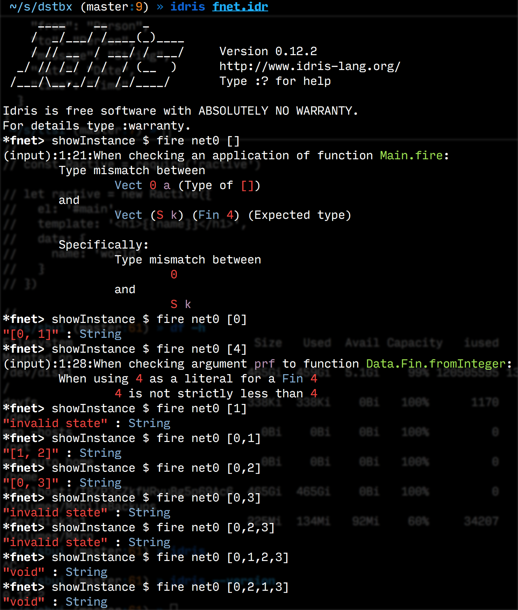

# Petri nets (*a la* Statebox) in Idris



As a follow-up on my talk on FPAMS, here is some basic dependently
typed petri nets in Idris.

It doesn't do much yet, just basic Petri nets, no colour,
no types.

No proofs... in particular initiality of the first
transition in an instance (`Init _ t0`).

Nor `Enabled <=> \Exist m. m --[t]--> m' /\ m' = m - (pre t) + (post
t)`.


What *is* "dependent" here is only the size of the two partitions.

That is, a `Net s t` is a petrinet where the set of places is
`Fin s` and the set of transitions `Fin t`.

For example:

    net : Net 4 4
    net = [
      ([], [0, 1]),
      ([0], [2]),
      ([1], [3]),
      ([2,3], [])
    ]

To create an instance, use the `Inst` data structure.

It has two constructors,

- `Init` takes a net and a transition
- `Fire` takes an instance and a transition

Fire the first transition

    i0 : Inst 4 4
    i0 = Init net 0

Fire another transition

    i1 : Inst 4 4
    i1 = Fire i0 1

We can now get the marking corresponding to the instances

    marking i0
    => Just [0, 1]

    marking i1
    => Just [1, 2]

Or obtain an instance directly from a net and a nonempty
transition firing sequence.

```
*fnet> :t fire
fire : Net s t -> Transitions -> Inst s t
```
